## Control the Deployment through Release Gates

Release Gates allow you to configure automated calls to external services, where the results are used to approve or reject a deployment. You can use gates to ensure that the release meets a wide range or criteria, without requiring user intervention. When a release is created from a definition that contains gates, the deployment stops until the health signals from all the configured services are successful.
Gates can be added to an environment in the release definition from the pre-deployment conditions or the post-deployment conditions panel. Multiple gates can be added to the environment conditions to ensure all the inputs are successful for the release.

**Pre-deployment gates:** You want to ensure there are no active issues in the work item or problem management system before deploying a build to an environment.

**Post-deployment gates:** You want to ensure there are no incidents from the monitoring or incident management system for the app after it's been deployed, before promoting the release.

At present the available gates include:

1. **Azure function:** Trigger execution of an Azure function and ensure a successful completion. For more details, see [Azure function task](https://docs.microsoft.com/en-us/vsts/build-release/tasks/utility/azure-function).
1. **Azure monitor:** Observe the configured Azure monitor alert rules for active alerts. For more details, see [Azure monitor task](https://docs.microsoft.com/en-us/vsts/build-release/tasks/utility/azure-monitor).
1. **Invoke REST API:** Make a call to a REST API and continue if it returns a successful response. For more details, see [HTTP REST API task](https://docs.microsoft.com/en-us/vsts/build-release/tasks/utility/http-rest-api).
1. **Work item query:** Ensure the number of matching work items returned from a query is within a threshold. For more details, see [Work item query task](https://docs.microsoft.com/en-us/vsts/build-release/tasks/utility/work-item-query).

In this lab, we will use Work item query as Pre-deployment gate and Application Insights as Post-deployment gates to monitor the application in Canary Environment. A [Canary](https://blogs.msdn.microsoft.com/devops/2017/04/24/configuring-your-release-pipelines-for-safe-deployments/) release is when you release some version of your application to a particular group of users, before it's released to everyone else. A canary release can help you to identify problems that surface in the production environment before they affect your entire user base. 

If there are any active bugs, deployment will not happen to Canary environment and after deployment if Application Insights detects any exception in Canary environment, deployment will not be promoted to Production.

## Pre-requisites

1. **Microsoft Azure Account:** You will need a valid and active azure account for the lab.

1. You will need a **Visual Studio Team Services Account**. If you do not have one, you can sign up for free here- https://www.visualstudio.com/products/visual-studio-team-services-vs

1. You will need a Personal Access Token (PAT) to set up your project using the Demo Generator.Please see this [article]((https://docs.microsoft.com/en-us/vsts/accounts/use-personal-access-tokens-to-authenticate)) for instructions to create your token.

    >**Note:**  You should treat Personal Access Tokens like passwords. It is recommended that you save them somewhere safe so that you can re-use them for future requests. 

## Exercise 1: Setting up Target Environment

In this lab we will create two **Web Apps** in Azure to depict two environments **Canary** and **Production** to deploy the application.

1. Go to Azure portal and click on **+ New** and click **Web App**.
    
    

1. Provide required details, and click create. We will turn on settings for **Application Inisghts** to monitor the app.
    
    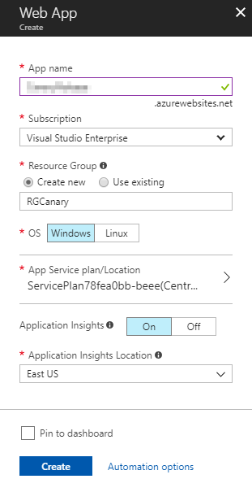

1. Once the deployment succeeds, go to resource group.
    
    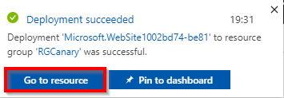

1. We will See Web App and Application Insights. Application Insights will monitor the Web App. Click on **Application Insights**.
    
    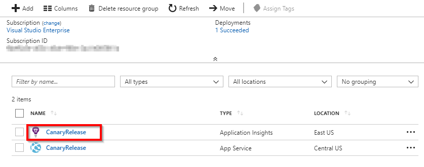

1. Let us add an alert for server exceptions. Scroll down and click on **Alerts**.
    
    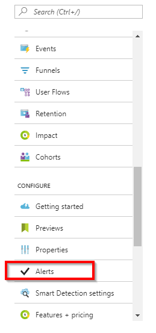

1. Click on **Add metric alert**

    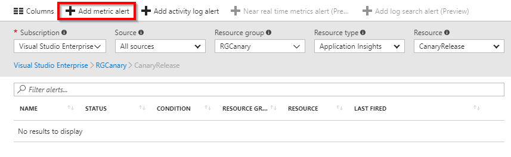

1. Provide name for alert and select **Server Exceptions** from the dropdown under metric and click **OK**.

    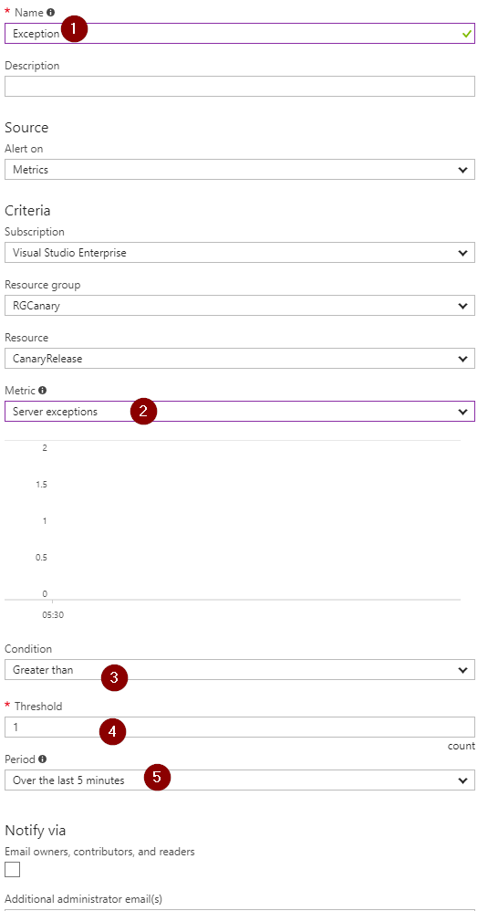

1. Follow the same steps as above to create another Web App, this time for production.

## Setting up Team Services project

1. Use [VSTS Demo Data Generator](https://vstsdemogenerator.azurewebsites.net/) to provision the project in VSTS account.

   

1. Provide a name for the project and click on **Create Project**. 

1. Once the project is provisioned, click the URL to navigate to the project.

   

   >Note: This URL will automatically select Release Gates template in the demo generator. If we want to try other projects, use this URL instead - https://vstsdemogenerator.azurewebsites.net/

## Exercise 1: Service Endpoint creation

Service endpoints are a bundle of properties securely stored by the VSTS and is a way for VSTS to connect to the external systems or services.

Since the connections are not established during project provisioning, Azure Resource Manager endpoint need to be created manually.

Azure Resource Manager Service Endpoint: Defines and secures a connection to a Microsoft Azure subscription using Service Principal Authentication (SPA).

1. In the VSTS, navigate to the **Services** by clicking on the **gear icon** Settings, and click on the **+ New Service Endpoint** button. Select the **Azure Resource Manager**.

   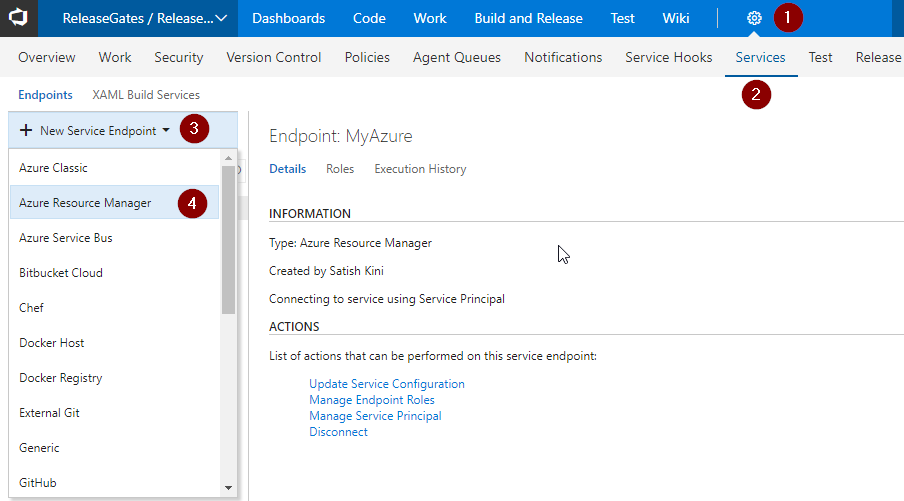 

1. Provide Connection name, select the Subscription from the dropdown and click on the OK button. This endpoint will be used to connect the VSTS and the Azure.

   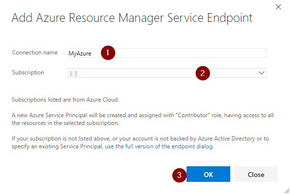

## Exercise 2: Enable preview feature Release Gates.

As Release Gates feature is still in preview, we should enable this feature to VSTS account.

1. In VSTS, click on logged in user and click Preview Features.
  
   

1. We will see **Approval gates in releases** turn it On.

   

## Exercise 3: Configure Deployment Gate.

### Enabling Pre-deployment Gate

1. Go to **Releases** under **Buid and Release** section, and **Edit** release definition.

   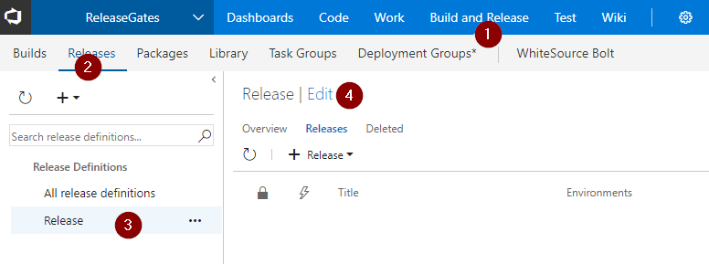

1. Click on **Post deployment option** as shown.

   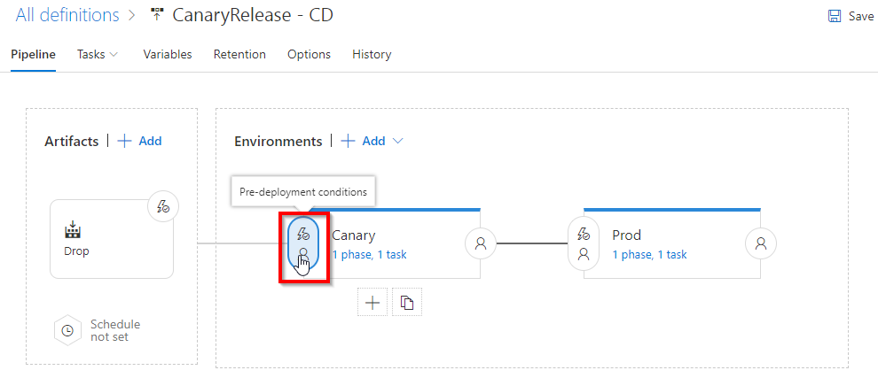 

1. Enable the Release Gates.

   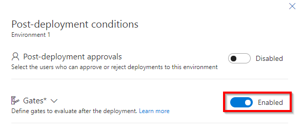

1. To allow gate functions to initialize and stabilize (it may take some time for them to begin returning accurate results), we configure a delay before the results are evaluated and used to determine if the deployment should be approved or rejected. For this example, so that we can see a result reasonably quickly, set the delay to a short period such as one minute.

1. Add **Query Work Items** to the Gates.

   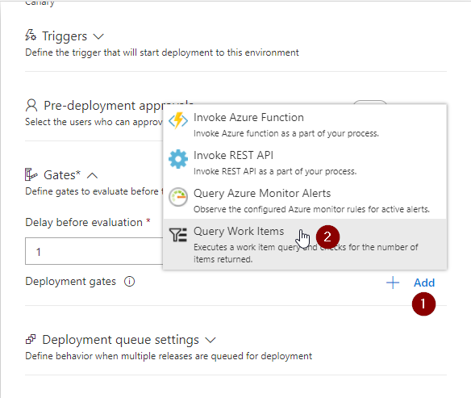

1. Select **Bugs** under Query. As maximum threshold is 0, if this query returns any work Item, the release gate will fail.

   

### Enabling Post-deployment Gate.

1. Click on Post-deployment conditions

   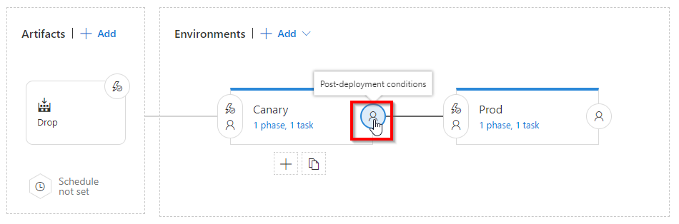

1. Add **Query Azure Monitor Alerts** to the gate.

   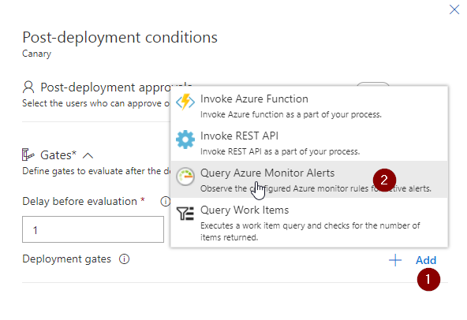
1. Update the details as shown and save.

   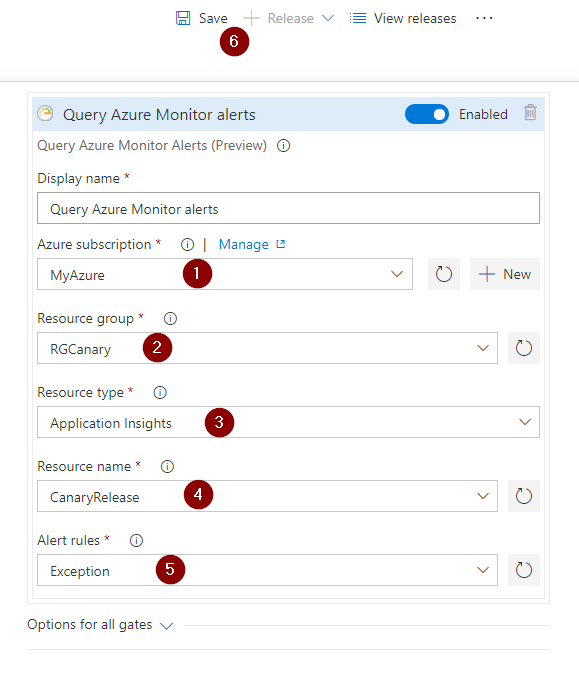

1.  Open the Options for all gates section and specify the timeout and the sampling interval. For this example, choose short periods so that we can see the results reasonably quickly. The minimum values we can specify is 6 minutes timeout and 5 minutes sampling interval.

    

    The sampling interval and timeout work together so that the gates will call their functions at suitable intervals, and reject the deployment if they don't all succeed during the same sampling interval and within the timeout period. 
### Update Release Task

1. Now let us update the release tasks with Azure web app. Click on task over Canary environment. 

   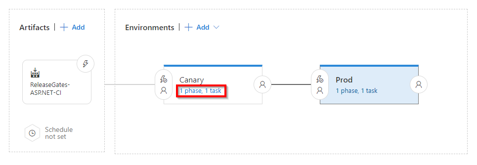

1. Update the Azure Subscription and App Service name.

   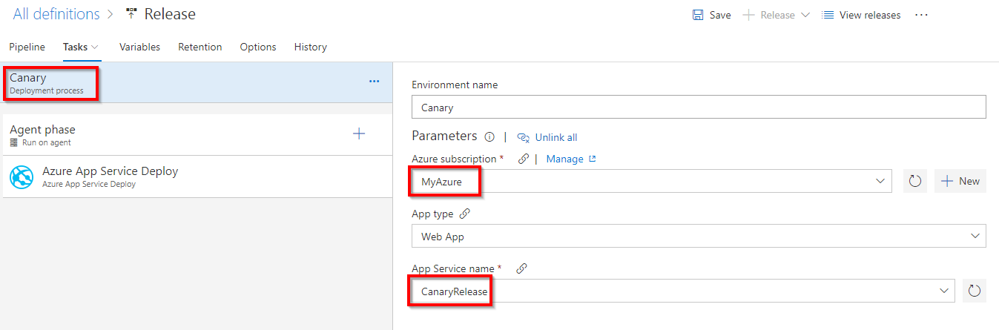

1. Update the tasks in Prod environment and save.

   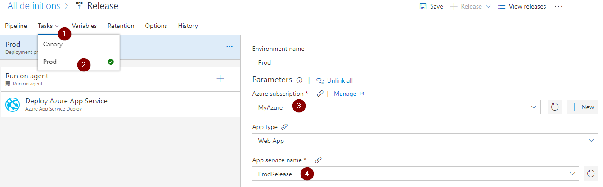

### Create New Release

1. Click on Release and Create release.
 
   

   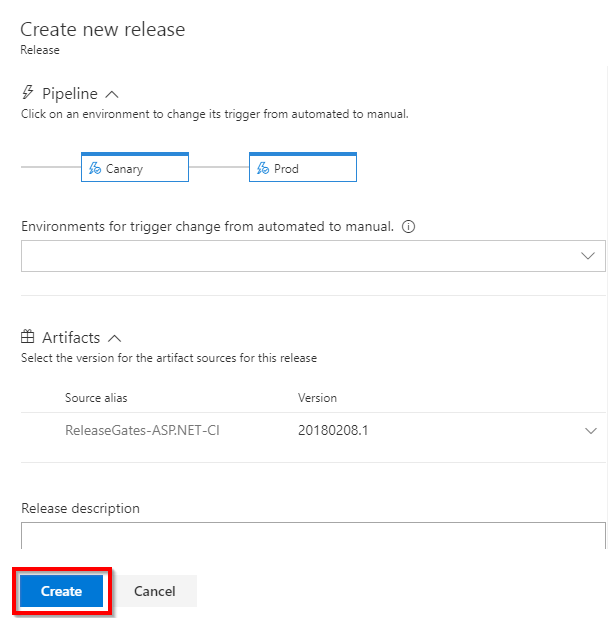

1. Go to Release logs to see the progress. We will see Query Work Items is failing, because there is an active bug. Next sampling time is after 5 minutes.

   
 

1. Now navigate to **Queries** under **Work** section.

   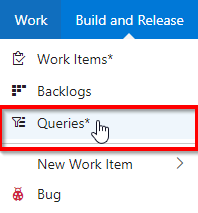

1. Select **Bugs** under **All**

   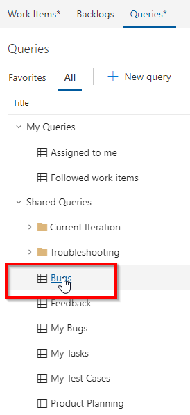

1. We can see a bug with title **Canary Server out of disk space** in **New** State. Assuming that the team has fixed the space issue, let us change the state to **Closed** and **Save** it.

   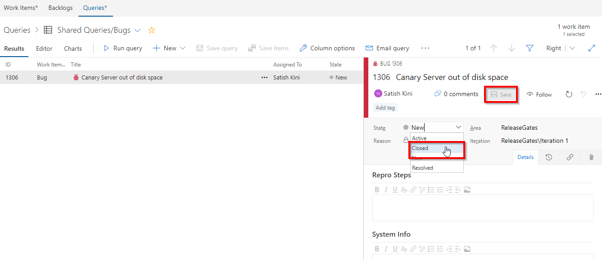 

1. Go back to release logs and wait for 5 mins. We will see the release gate is success. 

    

   >In this case, by the time Bug was fixed, it had already failed 3 samples.

1.  Now the pre-deployment release gate is success, hence the deployment of web app to Canary environment is started.

    

1. Once the deployment of the web app to Canary environment is done, we will see the post deployment gates in action, which will start monitoring the app for any exceptions. 

    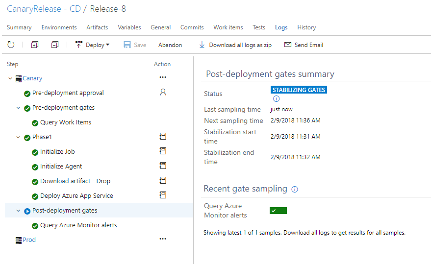

1. For the purpose of the lab, we have introduced an exception in **about** page in the applcation. So let us browse the application deployed to Canary Environment. When we go to **about** page, it will throw exception which will be captured by App-Insights and in turn the post-deployment gate.

    
1. In Azure Portal, we will be able to see the alert triggered.

   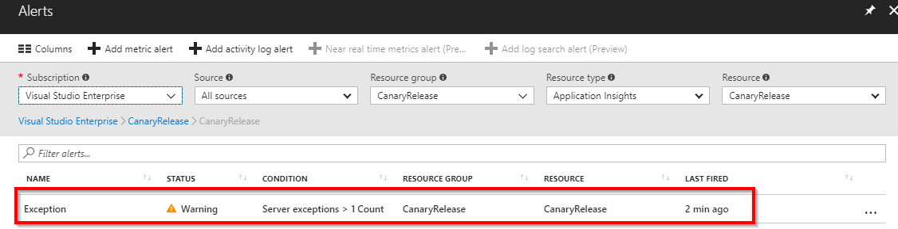
   
1. As there was an exception, Query Azure Monitor failed the Release. This release will be abandoned now. And a new release will be created once and the development team will debug and fix the issue.
   >Since the timeout period is set for 6 minutes in this lab, it could validate only two samples. in real time scenario we could for 24 Hrs. to monitor the application behavior and based on the result the app will be promoted to next stage.

   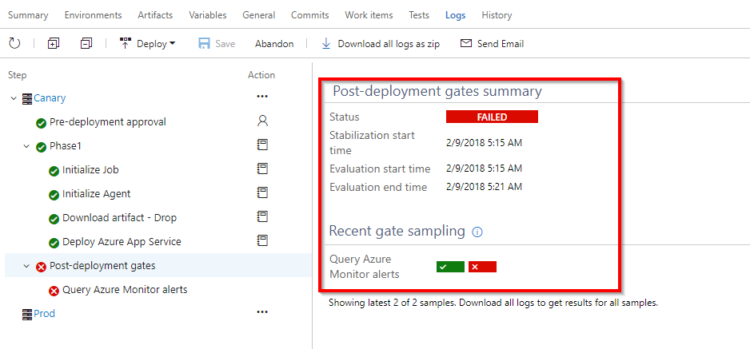  

Gates ensure the release waits for us to react to feedback and fix any issues within a timeout period. Until the issues are fixed, the gate samples continue to fail and the deployment waits. Once the issues are fixed, the next sample from the gates becomes successful and the deployment automatically proceeds.
If a new release is required to fix the issues, then we can cancel the deployment, and manually abandon the current release.

Release Gates will help the teams release applications with higher confidence and fewer manual inputs. 
    